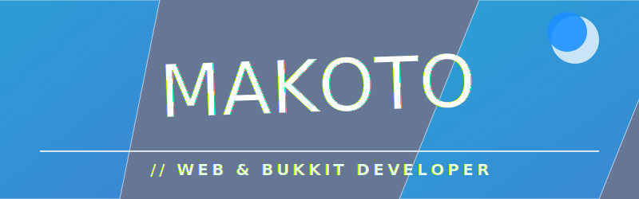

  

 

  
  
  

 

### INTRODUCTION

> *"I've been waiting for this..."*

Hi, I'm **Makoto**. I'm a passionate developer specializing in **Java** and **Minecraft (Bukkit)** server development since 2020. I also have a knack for creating beautiful, immersive frontend experiences with modern web technologies.

---

### TECH STACK

  

 

| Category | Technologies |
| :--- | :--- |
| **Backend** |    |
| **Frontend** |    |
| **Minecraft** |    |

---

### PROJECTS

<table width="100%">
  <tr>
    <td width="50%">
      <a href="https://github.com/yukmakoto/next-rust-platform">
        <h3 align="center">Next Rust Platform</h3>
      </a>
      
A high-performance community platform built with Next.js and Rust backend.

    </td>
    <td width="50%">
      <a href="#">
        <h3 align="center">Custom Bukkit Plugins</h3>
      </a>
      
Bespoke server-side plugins enhancing gameplay mechanics and server management.

    </td>
  </tr>
</table>

 

  
<i>"Burn My Dread."</i>

